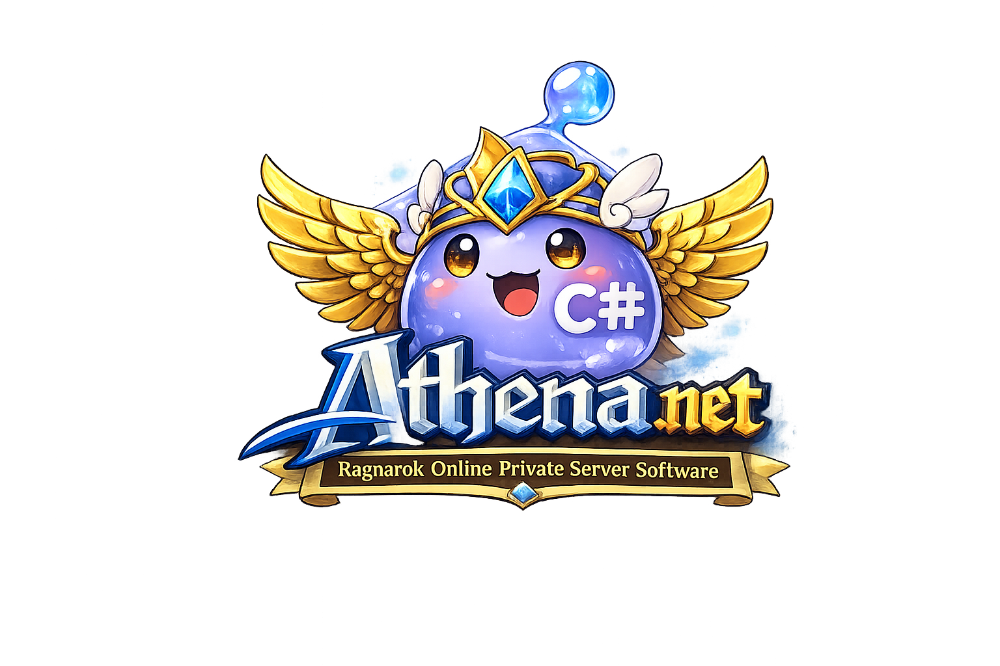

[![License][license-shield]][license-url]
[![Issues][issues-shield]][issues-url]
[![Stars][stars-shield]][stars-url]

  
  <h1 align="center" style="margin-top: 0;">Athena.NET</h1>
  

    A modern C# reimplementation of the rAthena server stack.
     
    <a href="docs/"><strong>Explore the docs »</strong></a>
     
     
    <a href="docs/installation.md">Installation</a>
    &middot;
    <a href="docs/configuration.md">Configuration</a>
    &middot;
    <a href="docs/aspire.md">.NET Aspire</a>
  

CI
- [![Login Server CI][login-ci-shield]][login-ci-url]
- [![Char Server CI][char-ci-shield]][char-ci-url]

  
Table of Contents

  <ol>
    <li><a href="#about">About</a></li>
    <li><a href="#status">Status</a></li>
    <li><a href="#quick-start">Quick Start</a></li>
    <li><a href="#docs">Documentation</a></li>
    <li><a href="#roadmap">Roadmap</a></li>
  </ol>

## About
Athena.NET is a clean, cross-platform C# rewrite of rAthena, focused on correctness, parity, and fast iteration.
The current milestone is a fully compatible LoginServer; CharServer and MapServer will follow as the migration progresses.

(<a href="#readme-top">back to top</a>)

## Status
- LoginServer: functional and actively aligned with legacy behavior.
- CharServer/MapServer: planned.

(<a href="#readme-top">back to top</a>)

## Quick Start
- [Install prerequisites and secrets](docs/installation.md)
- [Configure runtime settings](docs/configuration.md)
- [Run locally](docs/run-locally.md)
- [Run with .NET Aspire](docs/aspire.md)
- [Run with Docker Compose](docs/docker-compose.md)
- [Migrations](docs/migrations.md)
- [SQL Edge](docs/sql-edge.md)

Note: SQL credentials live in `solutionfiles/secrets/secret.json`. The AppHost reads this file to keep Aspire and the servers in sync. Aspire now uses a persistent SQL Edge volume named `athena-sql` to keep data across restarts.

(<a href="#readme-top">back to top</a>)

## Docs
- [Installation](docs/installation.md)
- [Configuration](docs/configuration.md)
- [Run locally](docs/run-locally.md)
- [.NET Aspire](docs/aspire.md)
- [Docker Compose](docs/docker-compose.md)
- [Migrations](docs/migrations.md)
- [Checklists](docs/checklists.md)
- [Helper scripts](docs/scripts.md)

(<a href="#readme-top">back to top</a>)

## Roadmap
- [x] LoginServer login flow parity and SQL Server support
- [x] Legacy config aliases and `import:` support
- [x] `login_msg.conf` message catalog support
- [ ] CharServer migration
- [ ] MapServer migration

(<a href="#readme-top">back to top</a>)

<!-- MARKDOWN LINKS & IMAGES -->
[license-shield]: https://img.shields.io/github/license/MarcoHuib/Athena.NET?style=for-the-badge
[license-url]: LICENSE
[issues-shield]: https://img.shields.io/github/issues/MarcoHuib/Athena.NET?style=for-the-badge
[issues-url]: https://github.com/MarcoHuib/Athena.NET/issues
[stars-shield]: https://img.shields.io/github/stars/MarcoHuib/Athena.NET?style=for-the-badge
[stars-url]: https://github.com/MarcoHuib/Athena.NET/stargazers
[login-ci-shield]: https://github.com/MarcoHuib/Athena.NET/actions/workflows/login-server-ci.yml/badge.svg?style=for-the-badge
[login-ci-url]: https://github.com/MarcoHuib/Athena.NET/actions/workflows/login-server-ci.yml
[char-ci-shield]: https://github.com/MarcoHuib/Athena.NET/actions/workflows/char-server-ci.yml/badge.svg?style=for-the-badge
[char-ci-url]: https://github.com/MarcoHuib/Athena.NET/actions/workflows/char-server-ci.yml
