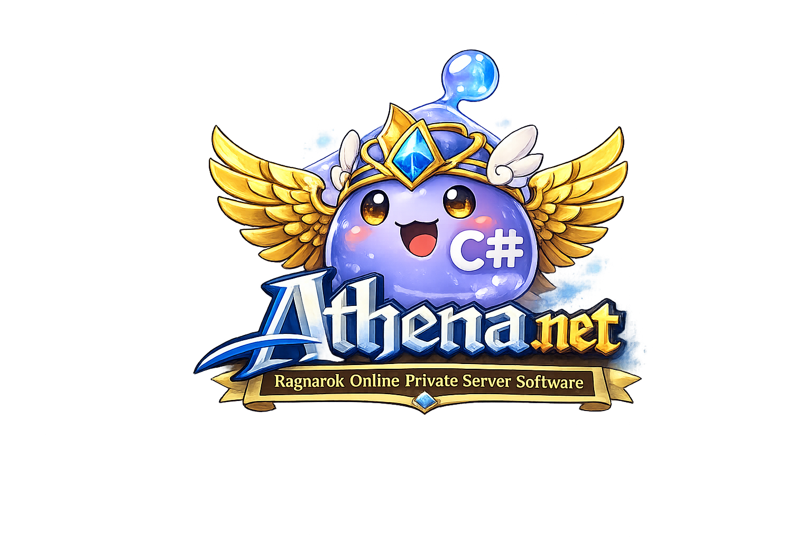

[![License][license-shield]][license-url]
[![Issues][issues-shield]][issues-url]
[![Stars][stars-shield]][stars-url]

  
  <h1 align="center" style="margin-top: 0;">Athena.NET</h1>

  

    A modern, cross-platform Ragnarok Online private server written in C# and built for the official International Ragnarok Online (iRO) client.
     
     
    <a href="docs/"><strong>Explore the docs »</strong></a>
     
     
    <a href="docs/installation.md">Installation</a>
    &middot;
    <a href="docs/configuration.md">Configuration</a>
    &middot;
    <a href="docs/aspire.md">.NET Aspire</a>
  

## CI

- [![Login Server CI][login-ci-shield]][login-ci-url]
- [![Char Server CI][char-ci-shield]][char-ci-url]
- [![Map Server CI][map-ci-shield]][map-ci-url]

  
Table of Contents

  <ol>
    <li><a href="#about">About</a></li>
    <li><a href="#project-status">Project Status</a></li>
    <li><a href="#reference-projects">Reference Projects</a></li>
    <li><a href="#quick-start">Quick Start</a></li>
    <li><a href="#documentation">Documentation</a></li>
    <li><a href="#roadmap">Roadmap</a></li>
    <li><a href="#project-scope">Project Scope</a></li>
  </ol>

## About

Athena.NET is a clean, modern C# implementation of a Ragnarok Online server stack focused exclusively on compatibility with the official **International Ragnarok Online (iRO)** client.

The project is inspired by the architecture and many years of experience behind mature Ragnarok Online server projects such as rAthena, while being designed as a modern .NET codebase with clear server boundaries, automated tests, cross-platform development, and maintainable infrastructure.

The goal is simple: build a modern iRO private server implementation without requiring a custom or modified game client.

(<a href="#readme-top">back to top</a>)

## Project Status

Athena.NET is under active development.

- **LoginServer** — working with the current stock iRO login flow.
- **CharServer** — character loading, creation, persistence and server handoff are working.
- **MapServer** — server foundation is running and current development is focused on completing the stock iRO map-entry flow.
- **Gameplay systems** — maps, movement, NPCs, items, skills, mobs, combat, quests and social systems will follow as the MapServer matures.

The project is not yet ready for production use or hosting a public game server.

(<a href="#readme-top">back to top</a>)

## Reference Projects

Athena.NET keeps two well-known Ragnarok Online projects in the `legacy/` directory as development references:

- `legacy/rathena/` — reference for server architecture, gameplay systems, database concepts, maps, scripts, NPCs, items, skills, mobs and tooling.
- `legacy/openkore/` — reference for client/server behavior and protocol research.

They are reference projects only. Athena.NET is not intended to be a generic rAthena or kRO-compatible server; the supported client target is iRO.

(<a href="#readme-top">back to top</a>)

## Quick Start

- [Install prerequisites and secrets](docs/installation.md)
- [Configure runtime settings](docs/configuration.md)
- [Run locally](docs/run-locally.md)
- [Run with .NET Aspire](docs/aspire.md)
- [Run with Docker Compose](docs/docker-compose.md)
- [Migrations](docs/migrations.md)
- [SQL Edge](docs/sql-edge.md)

Local development can be run through .NET Aspire, which starts the Athena.NET services and supporting infrastructure together.

(<a href="#readme-top">back to top</a>)

## Documentation

- [Installation](docs/installation.md)
- [Configuration](docs/configuration.md)
- [Run locally](docs/run-locally.md)
- [.NET Aspire](docs/aspire.md)
- [Docker Compose](docs/docker-compose.md)
- [Migrations](docs/migrations.md)
- [Checklists](docs/checklists.md)
- [Helper scripts](docs/scripts.md)
- [World-data importer](tools/WorldDataImporter/README.md)

Developer and protocol research notes are maintained separately under `ai/` so the public project README can remain focused on the project itself.

(<a href="#readme-top">back to top</a>)

## Roadmap

- [x] iRO LoginServer connectivity
- [x] iRO CharServer connectivity
- [x] Character loading and creation
- [x] Character persistence and selection
- [x] Handoff from CharServer to MapServer
- [ ] Complete MapServer authentication and first-map entry
- [ ] Player spawn, status and inventory
- [ ] Movement and map switching
- [ ] NPC and script interaction
- [ ] Items, equipment and skills
- [ ] Mobs and combat
- [ ] Quests, parties, guilds, storage and chat
- [ ] Administration and operational tooling
- [ ] Production hardening and deployment documentation

(<a href="#readme-top">back to top</a>)

## Project Scope

Athena.NET is an unofficial server implementation and is not affiliated with, endorsed by, or sponsored by Gravity Co., Ltd. or WarpPortal.

Ragnarok Online and related names and assets are the property of their respective owners.

Athena.NET is distributed under the terms described in [LICENSE](LICENSE).

(<a href="#readme-top">back to top</a>)

<!-- MARKDOWN LINKS & IMAGES -->
[license-shield]: https://img.shields.io/github/license/MarcoHuib/Athena.NET?style=for-the-badge
[license-url]: LICENSE
[issues-shield]: https://img.shields.io/github/issues/MarcoHuib/Athena.NET?style=for-the-badge
[issues-url]: https://github.com/MarcoHuib/Athena.NET/issues
[stars-shield]: https://img.shields.io/github/stars/MarcoHuib/Athena.NET?style=for-the-badge
[stars-url]: https://github.com/MarcoHuib/Athena.NET/stargazers
[login-ci-shield]: https://github.com/MarcoHuib/Athena.NET/actions/workflows/login-server-ci.yml/badge.svg?style=for-the-badge
[login-ci-url]: https://github.com/MarcoHuib/Athena.NET/actions/workflows/login-server-ci.yml
[char-ci-shield]: https://github.com/MarcoHuib/Athena.NET/actions/workflows/char-server-ci.yml/badge.svg?style=for-the-badge
[char-ci-url]: https://github.com/MarcoHuib/Athena.NET/actions/workflows/char-server-ci.yml
[map-ci-shield]: https://github.com/MarcoHuib/Athena.NET/actions/workflows/map-server-ci.yml/badge.svg?style=for-the-badge
[map-ci-url]: https://github.com/MarcoHuib/Athena.NET/actions/workflows/map-server-ci.yml
